# MX-Gathering Development Environments

This document outlines the development workflow and environment strategy for MX-Gathering.

## Philosophy: Develop in the Open

MX-Gathering follows an "open development" model where all development happens transparently in public repositories with clear separation between production, staging, and test environments.

**Benefits:**
- Community can see development progress
- Early feedback on features
- Transparent decision-making
- Educational for contributors

---

## Environment Overview

| Environment | Branch | Domain | Purpose | Auto-Deploy |
|-------------|--------|--------|---------|-------------|
| **Production** | `main` | [mx-thegathering.ai](https://mx-thegathering.ai) | Live site, stable releases | Yes |
| **Staging** | `staging` | [staging.mx-thegathering.ai](https://staging.mx-thegathering.ai) | Pre-production testing, QA | Yes |
| **Development** | `dev` | [dev.mx-thegathering.ai](https://dev.mx-thegathering.ai) | Active development, experiments | Yes |
| **Feature Preview** | `feature/*` | Auto-generated URL | Feature development and review | Yes |

---

## Branch Strategy

### Main Branches

#### `main` - Production Branch
**Purpose:** Stable, production-ready code

**Rules:**
- Protected branch
- Requires pull request review
- All tests must pass
- Only staging-tested code merges here
- Tagged releases (v1.0.0, v1.1.0, etc.)

**Deployment:**
- Automatic to mx-thegathering.ai on merge
- Creates GitHub release with tag
- Rollback supported

---

#### `staging` - Staging Branch
**Purpose:** Pre-production testing and QA

**Rules:**
- Semi-protected (fewer restrictions than main)
- Merge from dev or feature branches
- Extended testing period (24-48 hours minimum)
- Stakeholder review and approval

**Deployment:**
- Automatic to staging.mx-thegathering.ai on push
- Mirror of production configuration
- Test with real-world scenarios

**Testing Checklist:**
- [ ] All features work as expected
- [ ] No console errors
- [ ] Mobile responsiveness verified
- [ ] Cross-browser testing complete
- [ ] Performance metrics acceptable
- [ ] Accessibility audit passed
- [ ] Security headers verified

---

#### `dev` - Development Branch
**Purpose:** Active development and integration

**Rules:**
- Fewest restrictions
- Merge feature branches here first
- Can be unstable
- Regular resets from staging acceptable

**Deployment:**
- Automatic to dev.mx-thegathering.ai on push
- May have experimental features
- Breaking changes acceptable

---

### Feature Branches

#### Naming Convention

```text
feature/descriptive-name
fix/issue-description
docs/documentation-update
refactor/component-name
```

**Examples:**
```text
feature/event-calendar
fix/mobile-navigation
docs/hosting-guide
refactor/landing-page
```

#### Workflow

1. **Create feature branch from `dev`:**
   ```bash
   git checkout dev
   git pull origin dev
   git checkout -b feature/event-calendar
   ```

2. **Develop and commit:**
   ```bash
   git add .
   git commit -m "Add event calendar component"
   git push origin feature/event-calendar
   ```

3. **Create Pull Request:**
   - Target: `dev` branch
   - Automatic preview deployment created
   - Request reviews
   - Discuss in PR comments

4. **Merge to dev:**
   - After approval and tests pass
   - Delete feature branch after merge

5. **Promote to staging:**
   ```bash
   git checkout staging
   git merge dev
   git push origin staging
   ```

6. **Deploy to production:**
   ```bash
   git checkout main
   git merge staging
   git tag v1.1.0
   git push origin main --tags
   ```

---

## Deployment Platform: Cloudflare Pages

**Why Cloudflare Pages?**
- Free unlimited bandwidth
- Automatic branch deployments
- Preview URLs for every commit
- Edge network (global CDN)
- Built-in analytics
- No build time limits
- Excellent for static sites

### Cloudflare Pages Setup

#### 1. Connect Repository

1. Go to Cloudflare Dashboard → Pages
2. Click "Create a project"
3. Connect GitHub account
4. Select repository: `Digital-Domain-Technologies-Ltd/MX-Gathering`
5. Authorize Cloudflare access

#### 2. Configure Build Settings

**Framework preset:** None (static HTML)

**Build configuration:**
```yaml
Build command: (leave empty)
Build output directory: /web
Root directory: /
```

**Environment variables:** (none needed for static site)

#### 3. Configure Branch Deployments

**Production branch:** `main`
**Preview branches:** All branches

**Branch deployment patterns:**
```text
main         → mx-thegathering.ai
staging      → staging.mx-thegathering.ai  (custom domain)
dev          → dev.mx-thegathering.ai      (custom domain)
feature/*    → <branch-name>.mx-gathering.pages.dev
```

#### 4. Custom Domains

Add custom domains in Cloudflare Pages:

**Production:**
- Primary: `mx-thegathering.ai`
- Alias: `www.mx-thegathering.ai`

**Staging:**
- `staging.mx-thegathering.ai`

**Development:**
- `dev.mx-thegathering.ai`

#### 5. DNS Configuration

Add these DNS records in Cloudflare:

```dns
# Production
CNAME  @        mx-gathering.pages.dev  (Proxied: ON)
CNAME  www      mx-gathering.pages.dev  (Proxied: ON)

# Staging
CNAME  staging  mx-gathering.pages.dev  (Proxied: ON)

# Development
CNAME  dev      mx-gathering.pages.dev  (Proxied: ON)
```

Cloudflare Pages handles the routing based on branch.

---

## GitHub Actions Workflows

### Automated Checks on Pull Requests

Create `.github/workflows/pr-checks.yml`:

```yaml
name: Pull Request Checks

on:
  pull_request:
    branches: [main, staging, dev]

jobs:
  validate:
    runs-on: ubuntu-latest
    steps:
      - uses: actions/checkout@v4

      - name: Validate HTML
        uses: Cyb3r-Jak3/html5validator-action@v7
        with:
          root: web/

      - name: Check links
        uses: lycheeverse/lychee-action@v1
        with:
          args: --verbose --no-progress 'web/**/*.html'

      - name: Accessibility audit
        uses: pa11y/pa11y-ci@v3
        with:
          sitemap: web/sitemap.xml
```

### Automated Deployment Notifications

Create `.github/workflows/deployment-notify.yml`:

```yaml
name: Deployment Notifications

on:
  push:
    branches: [main, staging, dev]

jobs:
  notify:
    runs-on: ubuntu-latest
    steps:
      - name: Deployment notification
        run: |
          echo "Deployed to ${{ github.ref_name }} environment"
          # Add Slack/Discord webhook notification if desired
```

---

## Environment-Specific Configuration

### Environment Variables

Create `web/config.js` for environment-specific settings:

```javascript
// Environment configuration
const ENV = {
  production: {
    apiUrl: 'https://api.mx-thegathering.ai',
    analyticsId: 'prod-analytics-id',
    debug: false
  },
  staging: {
    apiUrl: 'https://api-staging.mx-thegathering.ai',
    analyticsId: 'staging-analytics-id',
    debug: true
  },
  development: {
    apiUrl: 'https://api-dev.mx-thegathering.ai',
    analyticsId: null,
    debug: true
  }
};

// Auto-detect environment
const hostname = window.location.hostname;
const currentEnv = hostname.includes('staging') ? 'staging'
                 : hostname.includes('dev') ? 'development'
                 : 'production';

const config = ENV[currentEnv];
```

### Environment Indicators

Add visual indicators in non-production environments.

Add to `web/index.html` in `<head>`:

```html
<!-- Environment indicator (only shown in non-prod) -->
<script>
  if (window.location.hostname !== 'mx-thegathering.ai') {
    const env = window.location.hostname.split('.')[0];
    const banner = document.createElement('div');
    banner.id = 'env-banner';
    banner.textContent = env.toUpperCase() + ' ENVIRONMENT';
    banner.style.cssText = `
      position: fixed;
      top: 0;
      left: 0;
      right: 0;
      background: ${env === 'staging' ? '#f59e0b' : '#ef4444'};
      color: white;
      text-align: center;
      padding: 4px;
      font-weight: bold;
      font-size: 12px;
      z-index: 10000;
    `;
    document.addEventListener('DOMContentLoaded', () => {
      document.body.prepend(banner);
      document.body.style.paddingTop = '28px';
    });
  }
</script>
```

---

## Testing Strategy

### Local Testing

**Requirements:**
- Modern web browser
- Simple HTTP server

**Run locally:**

```bash
# Option 1: Python
cd web
python3 -m http.server 8000

# Option 2: Node.js
npx serve web

# Option 3: PHP
cd web
php -S localhost:8000
```

Access at: <http://localhost:8000>

### Automated Testing

**HTML Validation:**
```bash
npx html-validate web/index.html
```

**Accessibility Testing:**
```bash
npx pa11y http://localhost:8000
```

**Link Checking:**
```bash
npx broken-link-checker http://localhost:8000
```

**Lighthouse Audit:**
```bash
npx lighthouse http://localhost:8000 --output=html --output-path=./report.html
```

---

## Deployment Workflow

### Standard Feature Development

```mermaid
graph LR
    A[Create feature branch] --> B[Develop locally]
    B --> C[Push to GitHub]
    C --> D[Auto-deploy to preview]
    D --> E[Create PR to dev]
    E --> F[Review & approve]
    F --> G[Merge to dev]
    G --> H[Auto-deploy to dev.mx]
    H --> I[Test on dev]
    I --> J[Merge to staging]
    J --> K[Auto-deploy to staging.mx]
    K --> L[QA testing]
    L --> M[Merge to main]
    M --> N[Auto-deploy to prod]
```



### Hotfix Workflow

For critical production fixes:

```bash
# Create hotfix from main
git checkout main
git pull origin main
git checkout -b hotfix/critical-fix

# Make fix and commit
git add .
git commit -m "Fix critical issue"
git push origin hotfix/critical-fix

# Create PR directly to main
# After approval, merge and deploy

# Backport to staging and dev
git checkout staging
git cherry-pick <commit-hash>
git push origin staging

git checkout dev
git cherry-pick <commit-hash>
git push origin dev
```

---

## Rollback Procedure

### Cloudflare Pages Rollback

1. Go to Cloudflare Pages dashboard
2. Navigate to Deployments
3. Find previous successful deployment
4. Click "Rollback to this deployment"

### Git-based Rollback

```bash
# Revert to previous commit
git checkout main
git revert HEAD
git push origin main

# Or reset to specific commit (use with caution)
git reset --hard <commit-hash>
git push origin main --force
```

---

## Monitoring and Analytics

### Production Monitoring

**Uptime:**
- UptimeRobot: <https://uptimerobot.com/>
- Monitor: `https://mx-thegathering.ai`
- Check interval: 5 minutes
- Alert: `tom.cranstoun@gmail.com`

**Analytics:**
- Plausible Analytics (privacy-focused)
- Track: pageviews, bounce rate, top pages
- Dashboard: <https://plausible.io/mx-thegathering.ai>

**Performance:**
- Cloudflare Web Analytics (free, built-in)
- Google Lighthouse CI
- WebPageTest weekly audits

### Error Tracking

**Sentry (optional):**
```javascript
// Add to web/index.html
<script src="https://browser.sentry-cdn.com/7.x.x/bundle.min.js"></script>
<script>
  if (window.location.hostname === 'mx-thegathering.ai') {
    Sentry.init({
      dsn: 'your-dsn',
      environment: 'production',
      tracesSampleRate: 0.1
    });
  }
</script>
```

---

## Security Considerations

### Environment Secrets

**Never commit:**
- API keys
- Passwords
- Private certificates
- Database credentials

**Use:**
- GitHub Secrets for CI/CD
- Cloudflare environment variables
- Environment-specific config files (gitignored)

### Security Headers

Configured in Cloudflare Pages:

```text
X-Content-Type-Options: nosniff
X-Frame-Options: DENY
X-XSS-Protection: 1; mode=block
Referrer-Policy: strict-origin-when-cross-origin
Permissions-Policy: geolocation=(), microphone=(), camera=()
```

### Content Security Policy

Add to `web/index.html`:

```html
<meta http-equiv="Content-Security-Policy" content="default-src 'self'; script-src 'self' 'unsafe-inline'; style-src 'self' 'unsafe-inline'; img-src 'self' data: https:; font-src 'self' data:;">
```

---

## Best Practices

### Commit Messages

Follow Conventional Commits:

```text
feat: add event calendar component
fix: resolve mobile navigation issue
docs: update hosting guide
style: improve button styling
refactor: simplify header component
test: add integration tests
chore: update dependencies
```

### Pull Request Template

Create `.github/PULL_REQUEST_TEMPLATE.md`:

```markdown
## Description
[Describe your changes]

## Type of Change
- [ ] Bug fix
- [ ] New feature
- [ ] Breaking change
- [ ] Documentation update

## Testing
- [ ] Tested locally
- [ ] Tested on preview deployment
- [ ] All tests pass
- [ ] Accessibility verified

## Screenshots
[If applicable]

## Checklist
- [ ] Code follows style guidelines
- [ ] Self-review completed
- [ ] Documentation updated
- [ ] No console errors
```

### Code Review Guidelines

**Reviewers should check:**
- Code quality and readability
- Accessibility compliance
- Performance implications
- Security considerations
- Test coverage
- Documentation accuracy

---

## Troubleshooting

### Issue: Deployment Failed

**Check:**
1. Cloudflare Pages build logs
2. Syntax errors in HTML/CSS/JS
3. Missing files or directories
4. Branch configuration

### Issue: Environment Not Updating

**Solutions:**
1. Force clear Cloudflare cache
2. Check DNS propagation
3. Verify branch is correctly configured
4. Check deployment status in dashboard

### Issue: Preview URL Not Working

**Solutions:**
1. Wait 2-3 minutes for deployment
2. Check GitHub Actions status
3. Verify Cloudflare Pages integration
4. Check repository permissions

---

## Contact and Support

**Development Questions:**
- GitHub Discussions: <https://github.com/Digital-Domain-Technologies-Ltd/MX-Gathering/discussions>
- Issues: <https://github.com/Digital-Domain-Technologies-Ltd/MX-Gathering/issues>

**Technical Support:**
- Email: <tom.cranstoun@gmail.com>

**Deployment Issues:**
- Cloudflare Support: <https://dash.cloudflare.com/support>

---

**Last Updated:** 24 January 2026
**Maintained By:** Tom Cranstoun
